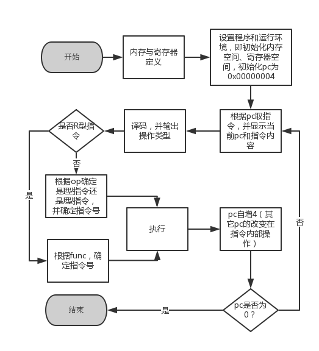

#用C模拟MPIS指令集中50条指令
操作系统：Mac OSX 10.10
编译环境：clang 6.1.0, make 3.81
已经提供Makefile，可以直接make
##操作：
已经设置好内存、寄存器组中的初始状态，可以直接[Enter]观看效果
##环境设置：
```
regs:
R1=1, R0=0
mem:
0x00000004: 0xa4010014(LW R1 (20)R1)
0x00000008: 0x04220001(ADDI R2 R1 1)
0x0000000c: 0xb8020014(SW (20)R0 R2)
0x00000010: 0xc7fffffc(J -4)
0x00000014: 1((20)R1 = 1)
```

##文件说明：
main.c：设置指令、数据；取指、译码、执行、pc更新等功能调用
instructions.c：实现50条mips指令
id.c：实现译码功能
mem.c：实现内存、寄存器读取操作模拟
op_and_operations.h：操作码枚举变量定义
instructions.h、id.h、mem.h：接口声明头文件

--------
##内存和寄存器模拟
内存和寄存器都是通过指针模拟，区分浮点和整型。内存是```char*```，而寄存器是```int*```和```float*```。***为了简化，这里不考虑寄存器的AH和AX访问能力***。所有访存操作必须通过接口函数进行，防止了违法访存行为。
mem.c
```cpp
/*
*文件：mem.c
*功能：完成内存、寄存器的定义；
*
*
*注意事项：
*/
#include <stdio.h>
#include "mem.h"

/*--------------------------------------------------------*/
/* mem_uint_write 将uint类型数据写入内存中 */
void mem_uint_write(unsigned operand, int addr) {
*(unsigned *)(mem_base + addr) = operand;//指针的类型转换，char* 转换为 uint*
}

/*--------------------------------------------------------*/
/* mem_uint_read 将uint类型数据从内存中读出 */
unsigned mem_uint_read(int addr) {
return *(unsigned *)(mem_base + addr);
}

/*--------------------------------------------------------*/
/* mem_int_write 将int类型数据写入内存中 */
void mem_int_write(int operand, int addr) {
*(int *)(mem_base + addr) = operand;//指针的类型转换，char* 转换为 int*
}

/*--------------------------------------------------------*/
/* mem_int_read 将int类型数据从内存中读出 */
int mem_int_read(int addr) {
return *(int *)(mem_base + addr);
}

/*--------------------------------------------------------*/
/* mem_ubyte_read 将ubyte类型数据从内存中读出 */
unsigned char mem_ubyte_read(int addr) {
return *(unsigned char*)(mem_base + addr);
}

/*--------------------------------------------------------*/
/* mem_ubyte_write 将ubyte类型数据写入内存中 */
void mem_ubyte_write(unsigned char operand, int addr) {
*(unsigned char *)(mem_base + addr) = operand;
}

/***************************************************************/
/* reg_int_write 将int类型数据写入寄存器中 */
void reg_int_write(int operand, int addr) {
//printf("operand: %d\n", operand);
*(ireg_base + addr) = operand;
//printf("%d\n", *((int *)(ireg_base + addr)));
//注意int和char之间的差别，既然传进来的是寄存器号，那必须4倍
//已经改用int，不再需要
}

/*--------------------------------------------------------*/
/* reg_int_read 将int类型数据从寄存器中读出 */
int reg_int_read(int addr) {
return *(ireg_base + addr);
}

/*--------------------------------------------------------*/
/* reg_uint_write 将uint类型数据写入寄存器中 */
void reg_uint_write(unsigned operand, int addr) {
*(unsigned *)(ireg_base + addr) = operand;//指针的类型转换，int* 转换为 uint*
}

/*--------------------------------------------------------*/
/* reg_uint_read 将uint类型数据从寄存器中读出 */
unsigned reg_uint_read(int addr) {
return *(unsigned *)(ireg_base + addr);
}
//addr开始形参是uint，实参却用了int。二者要对应

/*--------------------------------------------------------*/
/* reg_float_write 将float类型数据写入寄存器中 */
void reg_float_write(float operand, int addr) {
//这里的地址都是已经考虑了类型在里面的，都是以类型作为单位的了
*(freg_base + addr) = operand;
//此处不用指针类型转换，因为声明的就是float类型
}

/*--------------------------------------------------------*/
/* reg_float_read 将float类型数据从寄存器中读出 */
float reg_float_read(int addr) {
return *(freg_base + addr);
}

/*--------------------------------------------------------*/
/* reg_double_write 将double类型数据写入寄存器中 */
void reg_double_write(double operand, int addr) {
//这里的地址都是已经考虑了类型在里面的，都是以类型作为单位的了
*(double*)(freg_base + addr) = operand;
//此处不用指针类型转换，因为声明的就是float类型
}

/*--------------------------------------------------------*/
/* reg_double_read 将double类型数据从寄存器中读出 */
double reg_double_read(int addr) {
return *(double*)(freg_base + addr);
}
```
mem.h
```cpp
/*
*文件：mem.h
*功能：完成内存、寄存器声明；
*
*
*注意事项：
*/
#ifndef MEM
#define MEM
/* 主存、寄存器指针声明 */
extern char *mem_base;//主存的起始地址，动态分配在堆里
extern unsigned mem_size;

extern int* ireg_base;//整数寄存器的起始地址
extern unsigned ireg_size;

extern float* freg_base;//浮点寄存器的起始地址
extern unsigned freg_size;

//这是一个声明，包含这个文件，就已经把这一段声明复制过去了
//只不过定义在main函数里面
//main里面包含了也无所谓，声明可以有多个，定义只能有一个


/* 内存操作函数声明 */                                  //还有各种类型的读写可以做
void mem_uint_write(unsigned operand, int addr);//内存和寄存器在逻辑上最大的区别应该就是内存的数据类型相当丰富
unsigned mem_uint_read(int addr);				 //而MIPS似乎并没有CISC那样的AH、AX可以访问
void mem_int_write(int operand, int addr);
int mem_int_read(int addr);
unsigned mem_uint_read(int addr);
void mem_uint_write(unsigned operand, int addr);
unsigned char mem_ubyte_read(int addr);
void mem_ubyte_write(unsigned char operand, int addr);

/* 寄存器操作函数声明 */
void reg_int_write(int operand, int addr);
int reg_int_read(int addr);
void reg_uint_write(unsigned operand, int addr);
unsigned reg_uint_read(int addr);
void reg_float_write(float operand, int addr);
float reg_float_read(int addr);
void reg_double_write(double operand, int addr);
double reg_double_read(int addr);
#endif
```
- 内存的单入单出特性是调用的时候模拟的，不在接口设计的范围内
- 注意指针的转化，才能正确索引（解释）到想要的数据类型。主要是有无符号和块大小的区别
- 16进制，统一为```uint```
- 这里用了外部链接的全局变量，原因在于比较简单，可以很好的驾驭。而如果用接口，意义不大（不繁杂）
##指令译码
不区分I型R型J型指令，所有可能的字段，全部译码出来。
**设计原则：越分类，越复杂**
译码涉及移位、位相与、类型转换等底层内存操作
id.c
```cpp
/*
*文件：id.c
*功能：完成译码函数的编写
*
*
*注意事项：
*/

#include "id.h"

/* ID 将输入的instr指令译码为头文件声明的各字段 */
void ID(unsigned instr) {

op = (instr>>26) & 0x0000003f;//0000000000111111
rs1 = (instr>>21) & 0x0000001f;//0000000000011111
rs2 = (instr>>16) & 0x0000001f;
rd = (instr>>11) & 0x0000001f;
func = instr & 0x000007ff;//0000011111111111
imme_u = instr & 0x0000ffff;//1111111111111111
imme_i = (int)(short)(instr & 0x0000ffff);//必须先把高位的0全部去掉才能做有符号位扩展
offset = (((int)(instr<<6))>>6);//先左移，转换类型，算数右移
}
```
- ```imme_u```的截取和赋值模拟了从```uint```到```int```无符号扩展（逻辑左移）；
- 而```imme_i```之所以要先转换为```short```，也是为了去掉高位的0，再进行有符号扩展（算术左移）——转换为```int```的过程；
- R指令有立即数，op为0，序号在func字段；
- I指令序号在op，从1开始；
- J指令同I指令，有offset字段。具体可以查表；
- 枚举类型的使用，类似于宏矩阵。

##主逻辑

main.c
```cpp
/*
*文件：main.c
*功能：完成内存、寄存器的初始化；
*	  完成指令、数据的初始化；
*     完成控制逻辑（取指、译码、执行、写回）
*
*编译：gcc -o isa main.c instructions.c mem.c id.c 
*     不用带h文件，会自己找的
*运行：./isa
*输入：重复输入 Enter
*
*注意事项：由于更新方式有差别，为了控制逻辑的简洁，pc在每个函数里面自己更新
*/
#include <stdio.h>
#include <stdlib.h>

//#ifndef MEM
#include "mem.h"
//#endif

//#ifndef _H_ID
#include "id.h"
//#endif

//#ifndef _H_INSTRUCTIONS
#include "instructions.h"
//#endif

#include "op_and_func.h"

//#define DEBUG

/* 主存和寄存器定义，外部声明的全局变量 */
char *mem_base;
unsigned mem_size = 10000;//假设主存的大小是10000个字节

int* ireg_base;
unsigned ireg_size = 32;//32个寄存器整型寄存器

float* freg_base;
unsigned freg_size = 32;//32个浮点寄存器

int FPS;//浮点状态寄存器

/* 译码变量定义，外部定义的全局变量 */
unsigned op;//操作码
unsigned rs1;//源寄存器1
unsigned rs2;//源寄存器2
unsigned rd;//目的寄存器
unsigned func;//R功能
unsigned imme_u;//无符号扩展立即数
int imme_i;//有符号扩展立即数
int offset;//地址偏移量

/* 译码枚举变量声明 */
//extern enum Func oper_val;
//extern enum Oper func_val;

unsigned pc = 0x00000004;//认为程序的起始地址在4，必须是4的倍数！
unsigned instr;

int main(void) {

/* 分配空间，内存物理上就是char的组合 */
mem_base = (char *)malloc(sizeof(char)*mem_size);
if(mem_base == NULL) {
//如果分配失败
fprintf(stderr, "no enouph space for mem!\n");
exit(1);
}

ireg_base = (int *)malloc(sizeof(char)*ireg_size);
if(ireg_base == NULL) {
//如果分配失败
fprintf(stderr, "no enouph space for reg!\n");
exit(1);
}

freg_base = (float *)malloc(sizeof(float)*freg_size);
if(freg_base == NULL) {
//如果分配失败
fprintf(stderr, "no enouph space for reg!\n");
exit(1);
}
/*******************************************************/
/*  指令、数据初始化 */
mem_uint_write(0xa4010014, 0x00000004);//LW R0+0x00000014 (20) R1  101001(41), 00000, 00001, 0x0014
mem_uint_write(0x04220001, 0x00000008);//000001,00001, 00010, 0000000000000001,ADDI, R1, R2, 1
mem_uint_write(0xb8020014, 0x0000000c);//SW R0+0x00000014      R2  101110(46), 00000, 00010, 0x0014     
mem_uint_write(0xc7fffffc, 0x00000010);//110001(49),11111111111111111111111100 ,j -4*4
mem_uint_write(1, 0x00000014);

reg_int_write(1, 1);//R1=1
reg_int_write(0, 0);//R0=0，一直

/*******************************************************/
/* 控制逻辑 */
//instr = mem_uint_read(pc);//取第一条指令
//printf("instr0: %08X\n", instr);//8位16进制输出
while(pc) {
//pc放在函数里面修改，是不是不合适？
/* 取指令 */
printf("pc: 0x%08X\n", pc);
instr = mem_uint_read(pc);//取第一条指令
printf("instr: 0x%08X\n", instr);//8位16进制输出

/* 译码 */
//printf("%02X\n", op);//2位16进制
ID(instr);
printf("op: %d\n", op);

if(op) {//如果不是R型指令
oper_val = (enum Oper) op;//强制类型转换
switch(oper_val) {
case ADDI: instr_ADDI(); break;
case J: instr_J(); break;
case LW: instr_LW(); break;
case SW: instr_SW(); break;
default: {
fprintf(stderr, "can not be ided for instruction %u\n", op);
pc = 0;//结束程序
}
}
}
else {//如果是R型指令
func_val = (enum Func) func;
switch(func_val) {
case ADD: instr_ADD(); break;
case ADDU: instr_ADDU(); break;
default: {
fprintf(stderr, "can not be ided for instruction R func %u\n", func);
pc = 0;//结束程序
}
}
}

/* 改变pc值 */
pc += 4;
getchar();
}//pc=0，循环结束，程序结束

//#ifdef DEGUB

//#endif

/* free */
free(ireg_base);
free(mem_base);
free(freg_base);

return 0;
} /* main */
```
##指令实现
主要分为
读入操作数（译码阶段后半段工作）->执行（执行阶段）->写回（写回阶段）
两个半逻辑步骤以及显示指令一个功能步骤。
注意J型指令会修改pc，**注意-4，因为外面统一还要+4**

##其它
编写了makefile和readme
